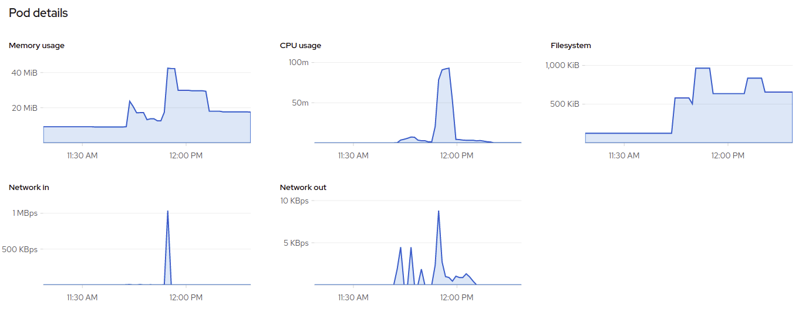

# GHODRAT

> WebRTC media servers stress testing tool

## Supported media servers

- ion-sfu
- janus

## Features

- Audio call
- Video call


## ION-SFU media-server under load

<p align="center">
  
</p>

## Janus media-server under load

<p align="center">
  
</p>

## Deployment

- ion-sfu

``` zsh
# update or create manifests
kubectl apply -f ./deployments/k8s/ion-sfu/configmap.yml
kubectl apply -f ./deployments/k8s/ion-sfu/job.yml

# delete manifests
kubectl delete -f ./deployments/k8s/ion-sfu/configmap.yml
kubectl delete -f ./deployments/k8s/ion-sfu/job.yml
```

- janus

``` zsh
# update or create manifests
kubectl apply -f ./deployments/k8s/janus/configmap.yml
kubectl apply -f ./deployments/k8s/janus/job.yml

# delete manifests
kubectl delete -f ./deployments/k8s/janus/configmap.yml
kubectl delete -f ./deployments/k8s/janus/job.yml
```

### Troubleshooting image

```bash
docker container run --entrypoint /bin/sh -it --rm ghcr.io/snapp-incubator/ghodrat-janus:latest
```
