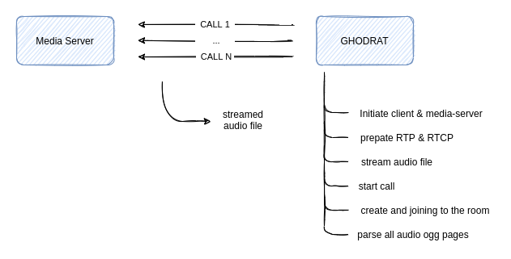
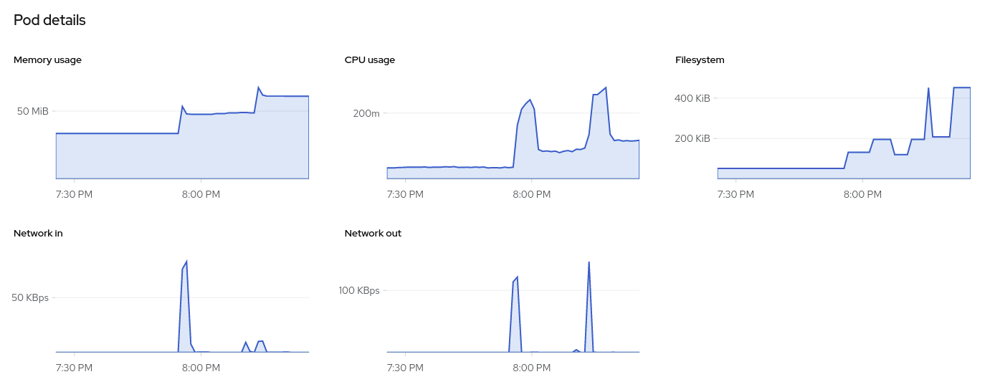

# GHODRAT

> WebRTC media servers stress testing tool (currently only Janus)

## Architecture

<p align="center">
  
</p>

## Janus media-server under load

<p align="center">
  
</p>

## Deployment

- ghodrat

    ``` zsh
    # update or create manifests
    kubectl apply -f ./deployments/ghodrat/k8s/janus/configmap.yml
    kubectl apply -f ./deployments/ghodrat/k8s/janus/job.yml

    # delete manifests
    kubectl delete -f ./deployments/ghodrat/k8s/janus/configmap.yml
    kubectl delete -f ./deployments/ghodrat/k8s/janus/job.yml
    ```

- 3p-janus

    ``` zsh
    helm upgrade --install janus ./deployments/third-parties/janus
    helm uninstall janus
    ```

### troubleshooting image

- docker container run --entrypoint /bin/sh -it --rm ghcr.io/snapp-incubator/ghodrat-janus:latest
