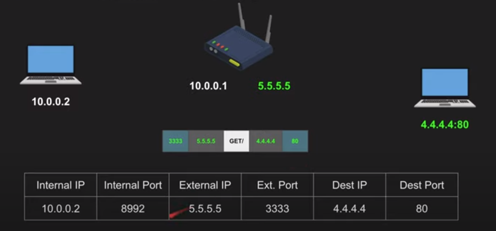
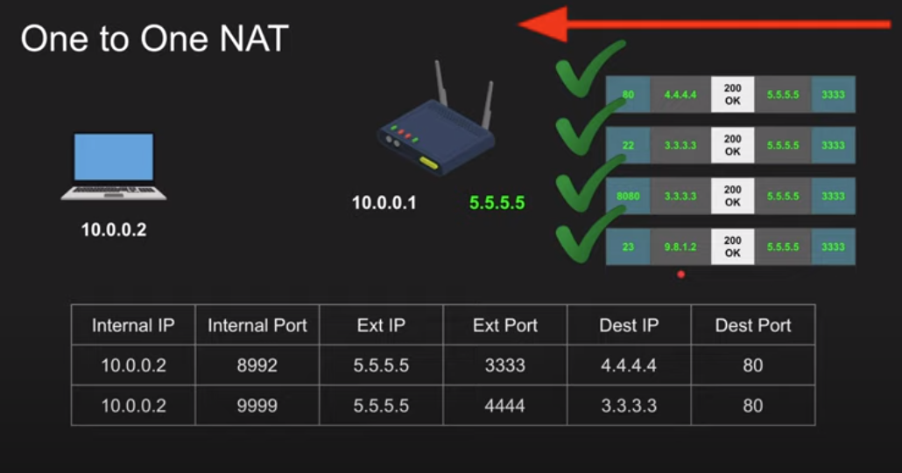
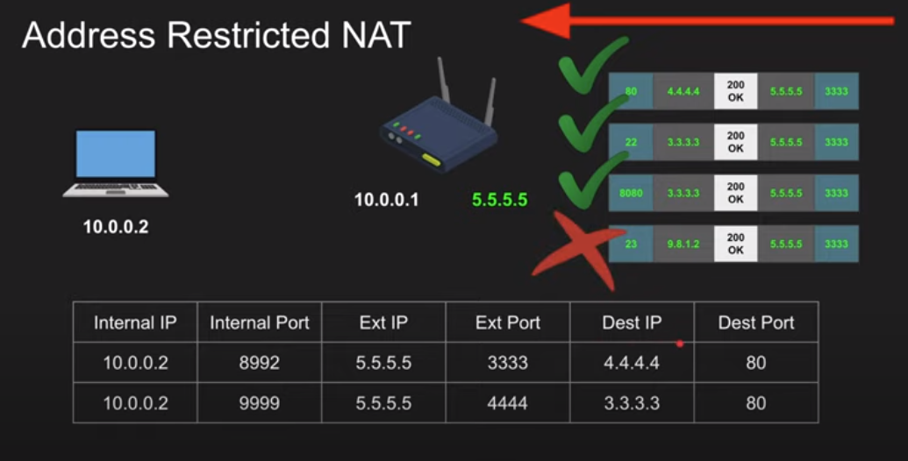
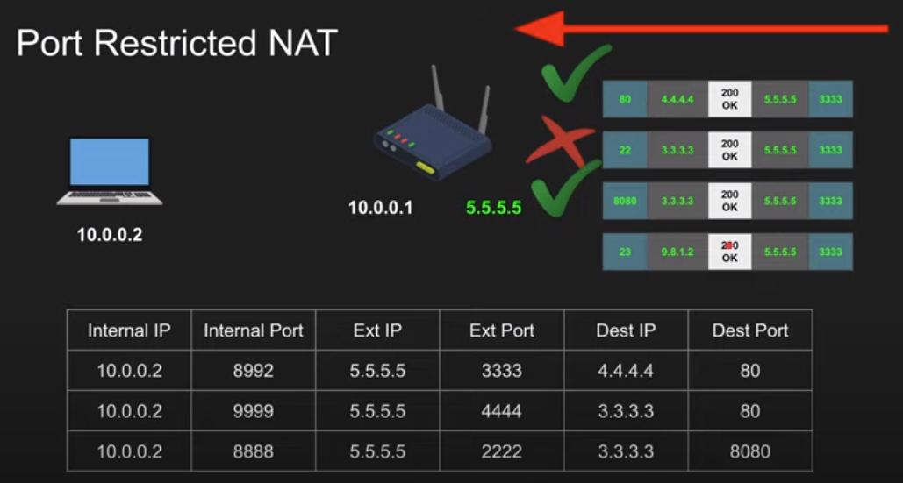
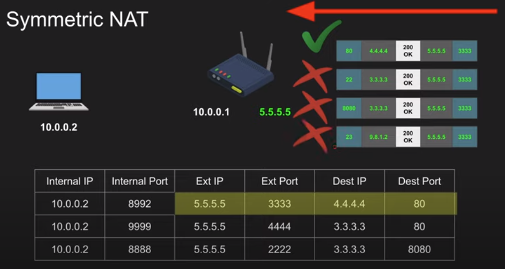
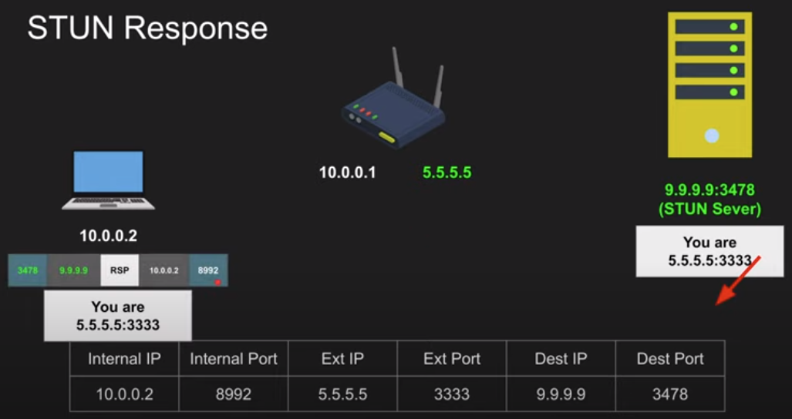
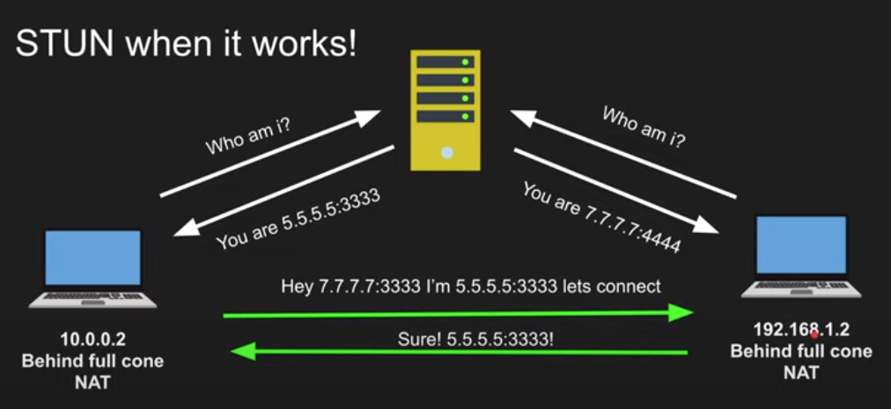
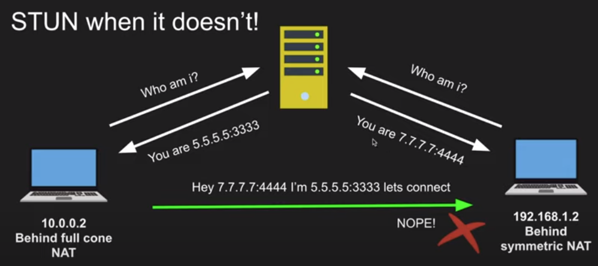
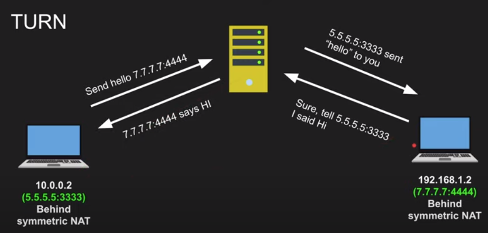
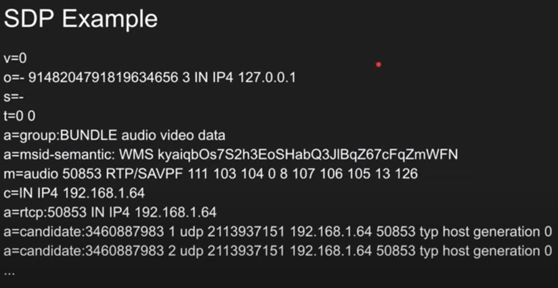

# GHODRAT

> WebRTC media servers stress testing tool (currently only Janus)

## COCEPTS

### Good resources

- https://webrtcforthecurious.com/

### WebRTC (web Real Time Communication)

> it's a low latency API to exchange video and audio in an efficient manner
> which will enable rich direct peer to peercommunicaton between clients
>
> in the process of connecting 2 peers we need signaling to communicate
> session information with each other (like whatsapp QR, HTTP fetch, WebSocket connection and ...)
> and after signaling is done , 2 peers can connect together via most optimal path

#### example precedure

- A wants to connect to B

- A create ICE and put it with other options into SDP

- A signals offer somehow to B

- B create it's own SDP

- B signals offer to A

- connection is created

### NAT (Network Address Translation)

> almost every device on internet is behind a NAT, means your are using a router (gateway)
> and your router's IP will communicate with world-wide-web, means first your device
> search for your requested IP address (you google sth and domain-name-server get you acual IP ),
> then your device search that if requested IP is under the same  `subnet` but if not, then it
> will request to the router to transer request packet to requested IP web-server (in the 
> process of transering, the router will create a table which iclude internal nd exernal IP & Port
> which will be replcaed via the router as requester)

### NAT Translation Methods

1. One to One NAT (Full-cone NAT)
    - packets to external <IP:Port> on the router always maps to internal <IP:Port> without exception

    

2. Address restricted NAT
    - packets to external <IP:Port> on the router always maps to internal <IP:Port> as long
    as source address from packet matches the table (regardless of port)

    - allow if we commnicated with this <host> before

    

3. Port restricted NAT
    - packets to external <IP:Port> on the router always maps to internal <IP:Port> as long
    as source address and port from packet matches the table

    - allow if we commnicated with this <host:port> before

    

4. symetric NAT
    - packets to external <IP:Port> on the router always maps to internal <IP:Port> as long
    as source address and port from packet matches the table

    - allow if the full pair match (it's for you and me)

    

### STUN (Session Traversal Utilities for NAT)

> it's a remote server which will return your public ip address
>
> tell me my public ip <address:port> throgh NAT (cheap to maintain)

- port 3478, 5349 for TLS

- works for first 3 models of NAT translations (not symetric)

    

- how clients behind Address/port restricted can connect to each other? 
The trick is they will try to communicate both with a dummy packet which will be blocked by each 
recipient (because no ip/port mapping ) exist but the second packet will pass because each device 
will see that they attempted to connect to the other one so packets will be allowed

- why can't symmetric NAT use this technique as well?
because the External Port is changed on each request.

- when stun doesn't work

    

### TURN (Traversal Using Relays around NAT)

> it's a server that just relays packets (expensive to maintain)

- in case of suymetric NAT we use TURN:
You would create a connection with a TURN server and tell all peers to send packets to the server which will then be forwarded to you. This obviously comes with some overhead so it is only used if there are no other alternatives.

- port 3478, 5349 for TLS

### ICE (Intercative Connectivity Establishment)

> it collects all available candidates (local IP addresses, reflexive addresses, STUN and TURN ones)
> whcih we call it `ice candicates`
>
> all the collected addresses are then sent to the remote peer via SDP

### SDP (Session Description Protocol)

> a format that describes ice candidates, networking, media, security and other options
>
> it's not really a protocol, it's a format

- most important concept in WebRTC

- the goal is to take the SDP generated by a user and send it somehow to other party

### Signaling

> a way to send SDP that we generated somehow to other party we wish communicate with
>
> it can be done via tweet, QR code, WebSocket, HTTP request (DOESN'T MATTER, just send it
> to the other party)
